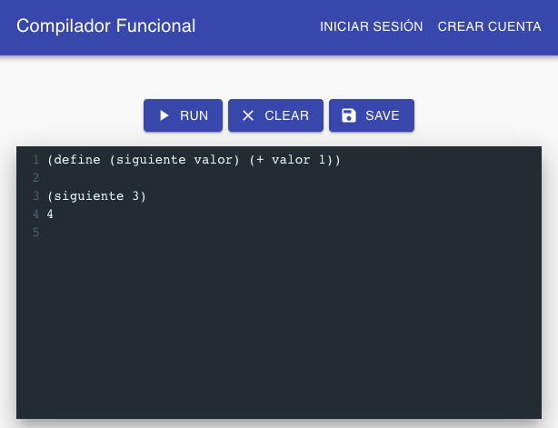

# Intérprete funcional [](https://travis-ci.org/UTN-FRD/construccion-compilador)

**Una implementación de Lisp en Rust** 

Proyecto de Investigación y Desarrollo de la Facultad Regional Delta de la Universidad Tecnologica Nacional


## Objetivo

Desarrollar un software educativo con el fin de que los estudiantes aprendan a construir compiladores e intérpretes 
de lenguajes de alto nivel, que además de incluir como elemento esencial un intérprete propiamente dicho, 
tenga una serie de características y herramientas complementarias que faciliten el proceso de aprendizaje. 




## Instalación y requerimientos técnicos

### Requirements

- [Rust (latest stable), via Rustup is recommended](https://www.rust-lang.org/tools/install)
- [rust fmt](https://github.com/rust-lang/rustfmt)
- [rust clippy](https://github.com/rust-lang/rust-clippy)
- [wasm-pack](https://rustwasm.github.io/docs/wasm-pack/)
- [nodejs](https://nodejs.org/es/) 12.x or newer
- git

### Running the interpreter

```
$ cargo run
```

### Running the web interpreter

First compile the Rust code to wasm

```
$ wasm-pack build
```

Install web dependencies

```
$ cp -R ./pkg site-react/src/
$ cd site-react/
$ npm install
```

Start the server

```
$ npm run start
```

The browser should open automatically once server is started.
If not, go to http://localhost:3000/


### Running tests

```
$ cargo test
```

### Code quality

- PRs MUST have passing builds to be merged
- be sure to auto format your code with `cargo fmt`
- add tests for new features
- be sure to use `cargo clippy` to detect common problems in your code (we cannot include this in the CI process because of an outstanding issue between clippy and lalrpop https://github.com/lalrpop/lalrpop/pull/384)


## Referencias

- [norvigs toy lisp impl](http://norvig.com/lispy.html): from which we got the basics
- [Racket lisp](https://docs.racket-lang.org/getting-started/index.html): the lisp implementation that we aim to (right now we are not very close but the ideal is to make something like Ractket syntax wise)
- [Racket lisp](https://stackoverflow.com/questions/41417892/what-is-the-difference-between-and-brackets-in-racket-lisp-programming) `()` vs `[]`
